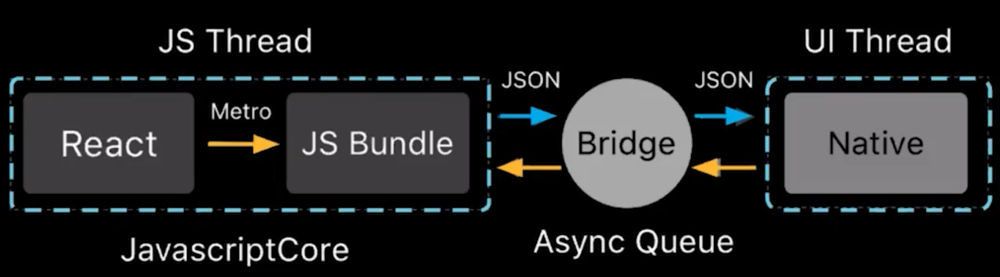

# React Native

* Es un framework para crear aplicaciones nativas usando React
* Permite construir aplicaciones nativas con JavaScript y React, para Android y iOS.



## Ventajas

* React
* Hot reload
* Debuggin. Flypper
* Multiplataforma

## Lista de componentes que ofrece React Native.

* View / ScrollView / SafeAreaView: Telefonos que tienen notch
* Text / TextInput
* Image / ImageBackground
* FlatList / SectionList
* Touchable Highlighth / Opacity / WithoutFeedback
* Animated
* fetch, async,await, sockets
* Platform
* AsyncStore: Base de datos local

## Cuando utilizar react native
* Si en el equipo cuantan con conocimiento de javascript
* Si se esta utiizando react.js en otros proyectos es facil que los programadores puedan colaborar con el equipo de desarrollo mobil.

## Como funciona

Native - RCT (React) Bridge - JavaScript Core

RCTNetworking: Para la transmision de datos para que se pueda entender desde javascript (fetch) y el dispositivo de forma nativa.

## Utilitarios

* Hot/Live reloading: Cada vez que se realice cambios la aplicación recarga en tiempo real en el emulador o dispositivo.
* Depuración de JvaScript. Para depurar la aplicación.
* Inspector de elementos en el telefono con las react dev tools.
* Network Inspector: Conecciones y recursos de red.
* Stack Trace: Indica que error tienes y da un indicio de como se podria resolverlo.

## Quienes lo usan

* Uber eats
* Instagram
* Facebook
* Wix
* Skype
* Printerest

## Crear un proyecto

Para crear un nombre del proyecto se debe ejecutar el siguiente comando. El nombre no debe tener guiones medios.

```bash
npx react-native init NombreProyecto
```

En IOS se debe además hacer los siguiente:

```bash
cd ios
pod install
```


## Herramientas

Metro:
Metro es un emaquetador (bundle) de JavaScript. Toma un archivo de entrada y varias opciones, y le devuelve un solo archivo JavaScript que incluye todo su código y sus dependencias.

## Iniciar aplicación REact Native

1.- Iniciar Metro:

```shell
npx react-native start
```

2.- Iniciar la aplicacion:

```shell
npx react-native run-android
```


## Realizar un enlace con un componente

```bash
react-native link nombreComponente
```